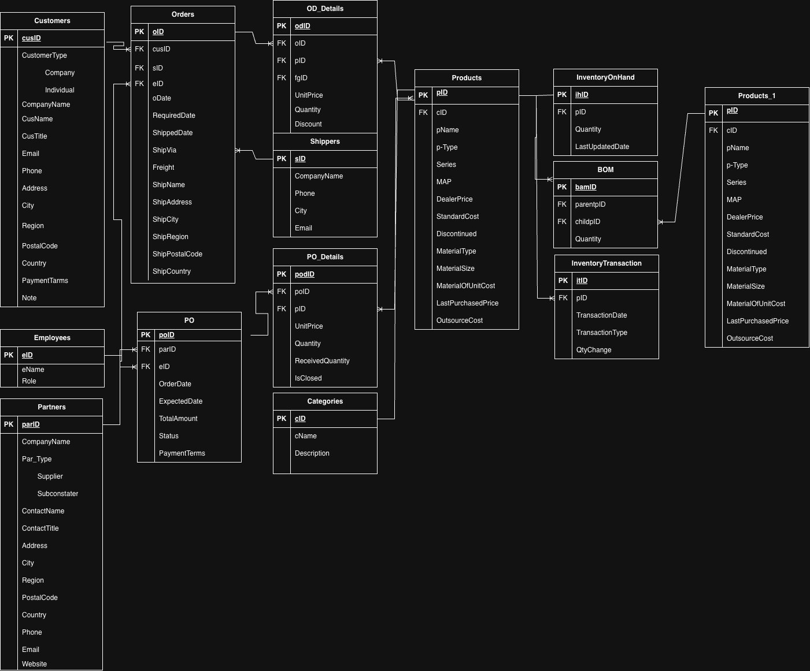
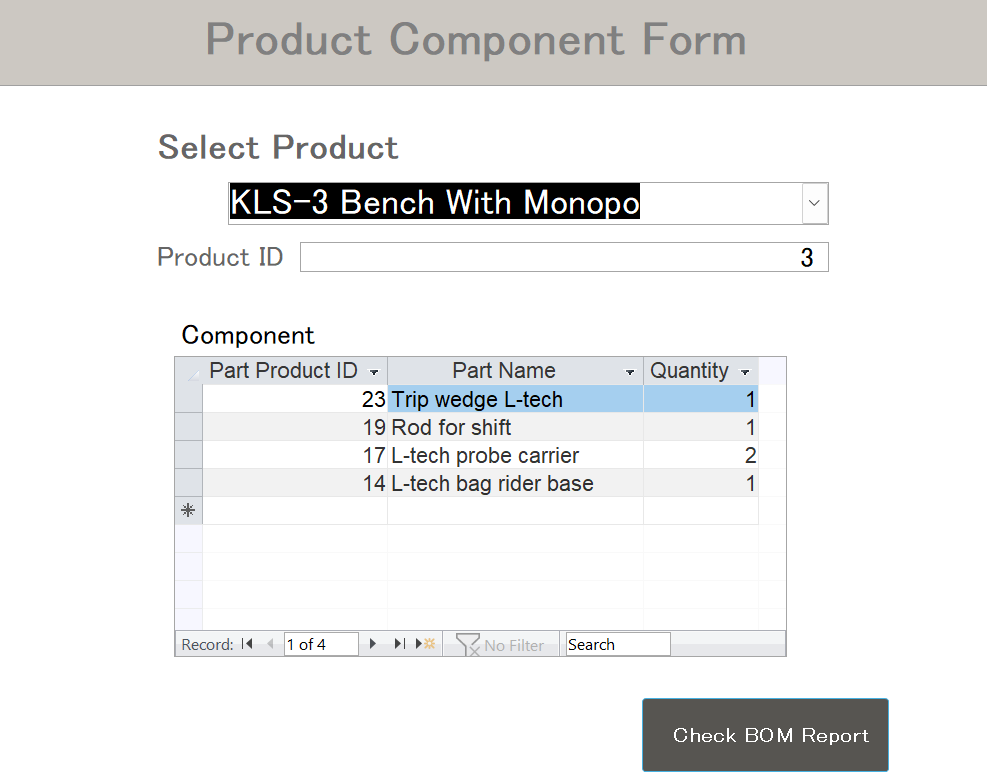
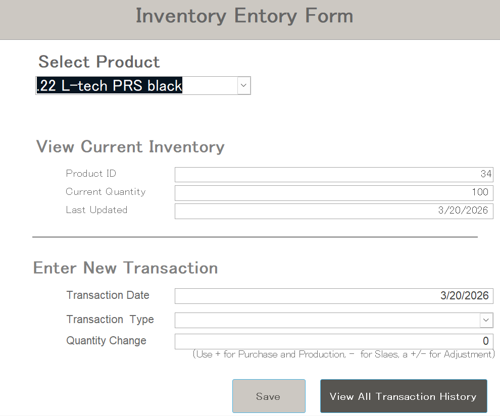
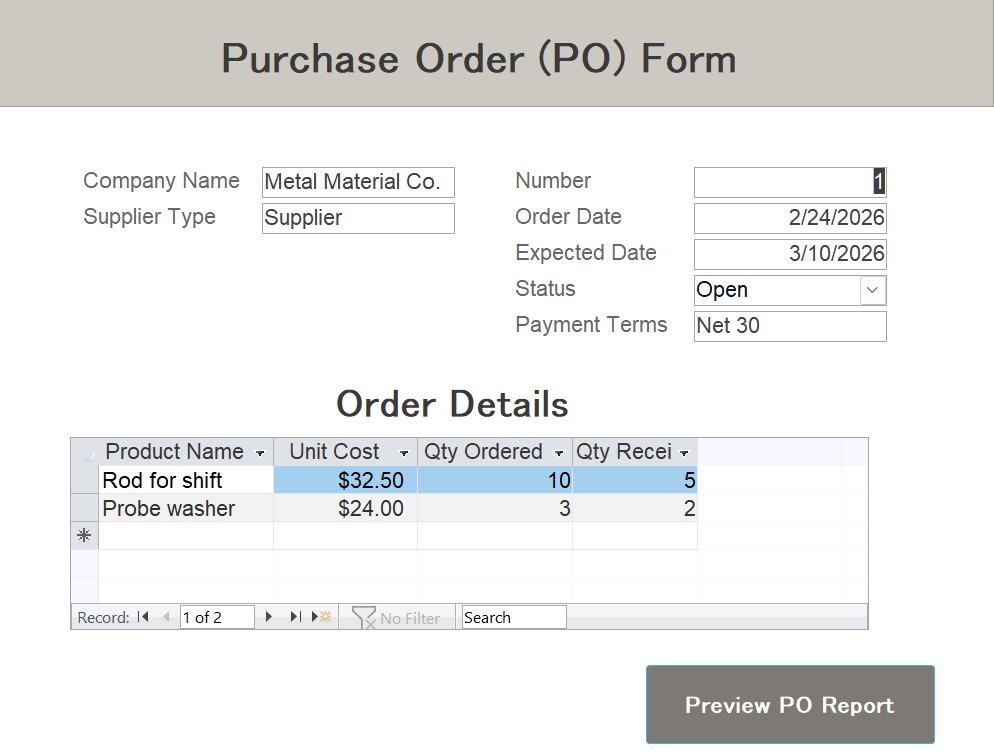
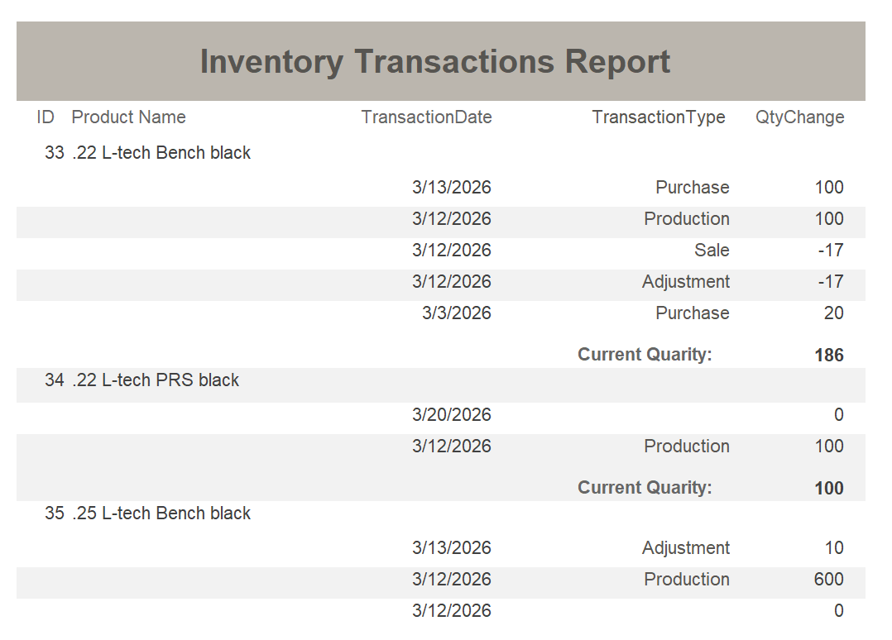

# Manufacturing Data Warehouse for CNC Operations

## Overview
This project presents a manufacturing data warehouse designed for a CNC machine shop producing airgun components and aftermarket accessories.

The system addresses operational challenges such as manual inventory tracking, lack of transaction history, and undocumented product structures. By implementing a structured database for BOM, inventory transactions, and purchasing, the system improves inventory visibility, reduces dependency on manual knowledge, and supports scalable shop floor operations.

---

## Business Context
The database is designed for a small manufacturing business where most operational information is managed manually or relies on the owner's experience.

Inventory data, product structures, and outsourcing processes are not centrally organized and are often scattered across different tools such as Shopify or informal records.

---

## Key Challenges
- No formal inventory transaction history  
- Manual inventory tracking with low visibility  
- BOM knowledge dependent on the owner  
- Difficulty identifying production bottlenecks  
- Fragmented data across systems (e.g., Shopify, spreadsheets)  

---

## Solution
The system introduces a structured manufacturing database that includes:

- **Bill of Materials (BOM)** to define product structures  
- **InventoryTransaction** to track all inventory movements  
- **InventoryOnHand** to maintain current stock levels  
- **Purchase Order system** to manage suppliers and outsourcing  

Forms and reports allow users to:
- Record inventory movements  
- View product structures  
- Manage purchasing operations  

---

## Business Impact
- Reduces reliance on manual knowledge and memory  
- Improves inventory visibility and traceability  
- Enables faster production planning  
- Supports onboarding of new employees  
- Provides foundation for future system integration (e.g., Shopify API)  

---

## Database Design

### Core Entities
- Products  
- Bill of Materials (BOM)  
- InventoryTransaction  
- InventoryOnHand  
- Purchase Orders and PO Details  
- Partners (Suppliers)  
- Employees  
- Categories  

---

## ER Diagram

### Key Design Highlights

#### BOM (Self-Referencing Structure)
The BOM table models the relationship between finished products and their components using a self-referencing design.

- `parentpID` → finished product  
- `childpID` → component or material  

Note: The duplicated Products table (Products_1) in the ER diagram represents a self-join alias. In implementation, both keys reference the same Products table.

---

#### Inventory Design (Transaction vs Balance)
- **InventoryTransaction** → records all movements  
- **InventoryOnHand** → stores current stock  

This design enables traceability and accurate inventory tracking over time.

---

## Design Considerations
To maintain usability for a small manufacturing environment, some cost and material attributes are stored directly in the Products table rather than fully normalized.

This simplifies operations while maintaining practical functionality.

---

## Data Flow Overview
1. Products and BOM define structure  
2. Purchase Orders manage procurement  
3. InventoryTransaction records movements  
4. InventoryOnHand reflects stock levels  

---

## Screenshots

### BOM Form (Parent–Child Structure)

---

### Inventory Transaction Form

---

### Purchase Order Form

---

### Sample Report

---

## Reflection

### Strengths
- Designed a practical BOM structure using main form and subform  
- Implemented inventory transaction logic  
- Improved debugging and troubleshooting skills  

### Challenges
- Filtering BOM reports due to self-referencing structure  
- Balancing design vs. Access limitations  
- Limited system error visibility  

### Improvements
- Define workflow before database design  
- Automate inventory updates with VBA  
- Expand to SQL-based systems and BI tools  

---

## Next Steps
- Shopify API integration  
- Order management system  
- Power BI dashboards  
- Automated inventory updates  

---

## Tools Used
- Microsoft Access  
- SQL  
- Data Modeling (ERD)  

---

## Author
Yumi Kuwana
M.S. in Data Analytics in Business
Seattle Pacific University
